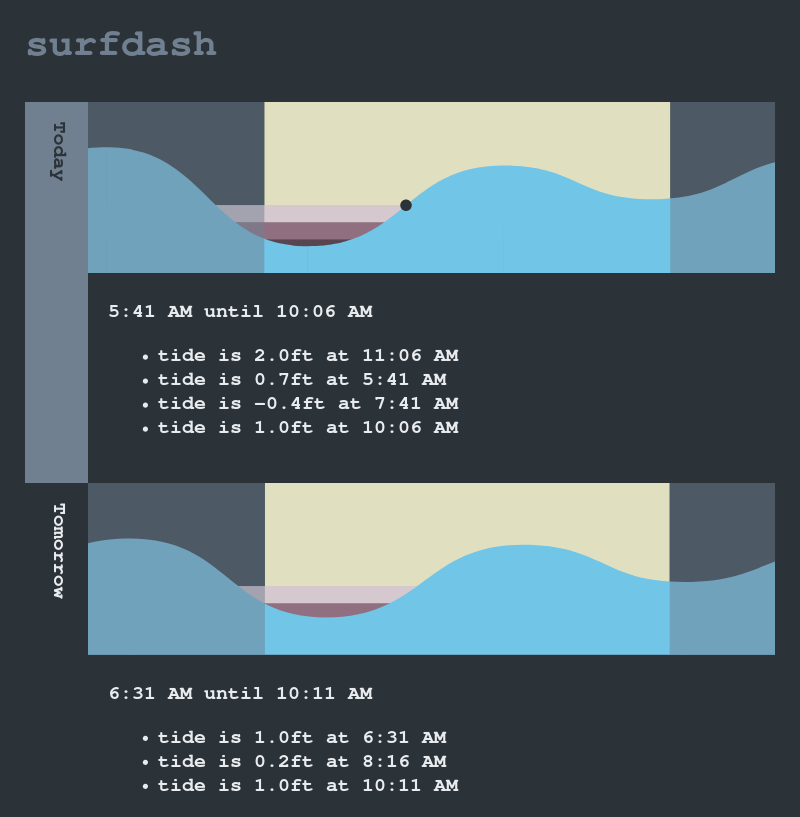

# Surf Dash

I wanted a simple and automated way to find potentially good times to surf. I
set up this system to query NOAA tide forecasts and compare them to sunrise and
sunset data.

Sample output:

```
Tomorrow at 5:20 PM, tide is low at 0.37ft
Sunday at 4:56 PM, tide is low at 0.23ft
Monday at 5:33 PM, tide is low at 0.15ft and 22 minutes after sunset
11/11 at 1:14 PM, tide is low at 1.29ft
11/12 at 2:04 PM, tide is low at 0.49ft
11/13 at 2:53 PM, tide is low at -0.23ft
```

I liked the text but wanted a glanceable visual representation as well. Here's a
sample screenshot of what I was able to come up with. The tide graph is
interactive - hovering over it shows the position with a dot and displays the
tide height in the detail section.


